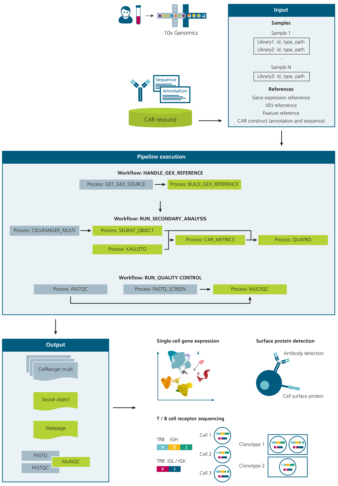
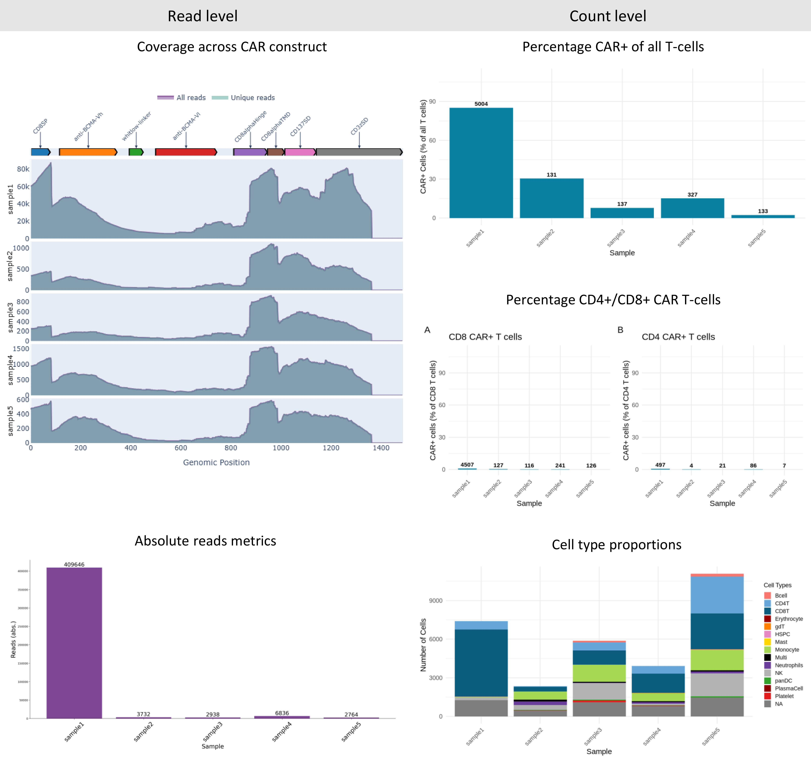
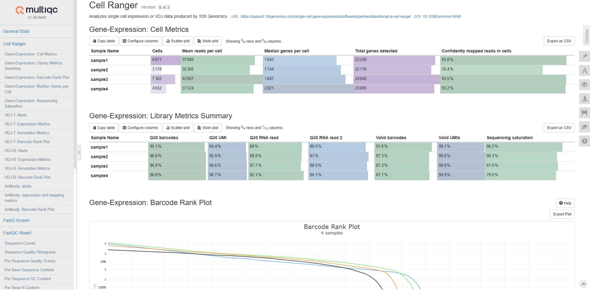

# CERTOMICS
<div class="grid cards" markdown>
-   __:rocket: Getting started__

    ---
    If you're only interested in how to use the pipeline and its inputs, head over to the quickstart guide. 

    [:arrow_right: Get started quickly](#quickstart-guide)

-   __:book: What is CERTOMICS__

    ---
    Want to understand what CERTOMICS is and how it works?

    [:arrow_right: What is CERTOMICS](#what-is-certomics)
    [:arrow_right: Documentation](#documentation)
</div>

# What is CERTOMICS
This Nextflow-based pipeline offers enhanced **cert**ainty in immunophenotyping and data interpretation, tailored for single-cell multi**omics** profiling of adoptive cellular immunotherapies. _CERTOMICS_ enables comprehensive immune profiling by supporting single-cell 10x Genomics technologies, such as gene expression (GEX) sequencing, cell surface protein detection, and V(D)J (TCR and BCR) sequencing. To reliably characterize CAR-positive cells, the pipeline enables CAR detection based on a custom reference and incorporates specialized quality control metrics to ensure robust identification of CAR-positive cells. 

{.half-size}

## Pipeline Overview
The pipeline is structured into three main processes: handling 10x data and libraries, performing core secondary analysis, and running quality control. The key feature of the pipeline is its ability to detect CAR-positive cells by incorporating a dedicated reference processing step. For this step, the user simply provide a CAR sequence file `.fasta` and CAR annotation file `.gtf`, for which CAR+ cells should be detected. For detailed explanation see: [References](https://fraunhofer-izi.github.io/Living-Drugs-Wiki/Home/Pipelines/CERTOMICS-Pipeline/Documentation/reference_building/). Common CAR sequences and annotation information can be found in our [Resource](https://fraunhofer-izi.github.io/Living-Drugs-Wiki/Home/Resources/).

- `Workflow: HANDLE_REFERENCES` - Generates custom reference files for  CellRanger based on the sequencing libraries (GEX, VDJ,
ADT) and the CAR construct (FASTA, GTF) given.
- `Workflow: RUN_SECONDARY_ANALYSIS` - Executes CellRanger multi and generates a merged, annotated Seurat object, and computes CAR-specific quality control metrics, with
results summarized in a dedicated webpage.
- `Workflow: RUN_QUALITY_CONTROL` - Conducts quality control assessments
using FASTQC (v0.12.1) FASTQ Screen (v0.15.3), and a custom multi-modal MultiQC (v1.24.1) module evaluate quality and composition of a multi-modal single-cell
sequencing experiment.


## Single-cell multi-omics

### Cellranger multi
CERTOMICS allows for processing various combinations of gene expression and V(D)J libraries, with or without feature barcode libraries, across multiple samples derived from peripheral blood mononuclear cells (PBMCs). Specifically, it supports the analysis of common 10x Genomics single-cell (immune profiling) libraries using CellRanger Multi.

### Seurat Object Output
The output of this pipeline is a merged Seurat object containing multi-modal single-cell data (RNA, VDJ and ADT assays) along with extensive metadata on cell type identity, quality metrices, cell cycle, and clonotype information, which serves the purpose of enabling detailed characterization and quality assessment of diverse cell populations from multiple samples. For a detailed explanation please see: [Seurat Output](./Documentation/output.md#seurat-object)

## Quality Control

### CAR-specific Metrics
Within a interactive summary webpage (see [Example](../../../images/pipelines/CERTOMICS/ExampleWebpage.png)), CAR-specific quality control metrics are included. CAR-specific metrics are derived from two levels of data: ”Read-level” metrics, based on mapped sequencing reads and ”Count-level” metrics, based on CellRanger raw counts. 

 - Read-level metrics include coverage plots across the
CAR construct, enabling assessment of read distribution
and sequencing protocol performance (50 or 30), as well
as absolute read counts per sample to evaluate transgene
expression levels. Additionally, a comparison of kallisto-
based estimated counts to alternative CAR isoforms can be
included, serving as negative or internal controls to assess
detection specificity.
 - Count-level metrics provide biological insights by
quantifying CAR-positive cell frequencies at different
immune cell populations. This allows the assessment of
patient-specific variability or comparison across different
condition, e.g. before vs. after CAR expansion, as well as a
negative control from CAR-negative cell populations.

In addition to CAR-specific quality control, the webpage presents general GEX-specific statistics, including cell proportions, as well as VDJ sequencing statistics, such as clonotype composition for both T and B cells. These additional metrics provide insights into TCR/BCR diversity, expansion patterns, and immune repertoire changes, which are critical for understanding persistence, functionality, and immune cell interactions.



### Multi-QC Report
Provides an MultiQC overview of general quality metrics via [FastQ-Screen](https://www.bioinformatics.babraham.ac.uk/projects/fastq_screen/) and [FastQC](https://www.bioinformatics.babraham.ac.uk/projects/fastqc/):



# Quickstart guide
## Downloading the pipeline
To install the pipeline, simply download the Git repository via HTTP.

```sh
git clone https://github.com/fraunhofer-izi/CERTOMICS.git
```

Before attempting to run the pipeline, ensure that Nextflow is installed and up-to-date (`version >= 24.10.2`). If you use the pipeline with the Singularity containers (recommended via`-profile sigularity`), Singularity must be installed and included in PATH, as well.

## Supplying data
To provide all the necessary data (references, samples, etc.) a separate file is used. All values are captured in the YAML (or JSON) format in a so-called parameters file (or params-file) and passed to the pipeline with the `-params-file` flag.
The parameters file should look something like this:

```YAML
gene_expression_reference: "/path/to/gex/reference"
vdj_reference: "/path/to/vdj/reference"
samples:
  - name: 'sample_1'
    libraries:
      - fastq_id: 'sample_1_R'
        fastqs: "/path/to/sample_1_R"
        feature_types: 'Gene Expression'
      - fastq_id: 'sample_1_B'
        fastqs: "/path/to/sample_1_B"
        feature_types: 'VDJ-B'
```

A full explanation of the options you have and how to populate your own params-file can be found [here](./Documentation/params-file.md).

# Documentation
To get a better understanding of what you can do with the pipeline and the options you have, check out the documentation

- [Params-file](./Documentation/params-file.md) with examples
- [Command line arguments](./Documentation/cli.md)
- [Pipeline output](./Documentation/output.md)
- [How is the reference built](./Documentation/reference_building.md)
