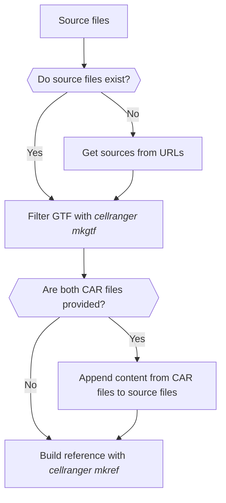

# Handling References
If no prebuilt reference is provided via parameters, a custom one is generated on the fly using the processes defined in the `workflows/handle_references.nf` script.

## Required Files
To build a custom reference, you need two files:

- a **FASTA** file and
- a **GTF** file

These files can be supplied directly via the input parameters `gene_expression_source_fa` and `gene_expression_source_gtf`. Alternatively, if not provided, the pipeline can download them from a specified URL using `gene_expression_source_fa_url` and `gene_expression_source_gtf_url`.

## Process Overview
1. **Fetching Source Files (`GET_SOURCE`)**  
   This step handles downloading files from URLs when needed. If the files are already provided, they are simply passed along.

2. **Filtering the GTF File (`FILTER_GTF`)**  
   The source GTF file is filtered to include only `gene_biotype:protein_coding` entries using `cellranger mkgtf`.

3. **Merging CAR Files (`CONCAT_CAR`)**  
   If **both** CAR files (`gene_expression_car_fa` and `gene_expression_car_gtf`) are provided, their content is appended to the corresponding source files.

4. **Building the Reference (`BUILD_REFERENCE`)**  
   Finally, the processed FASTA and GTF files are used to generate the reference with `cellranger mkref`.

## Simplified diagram

