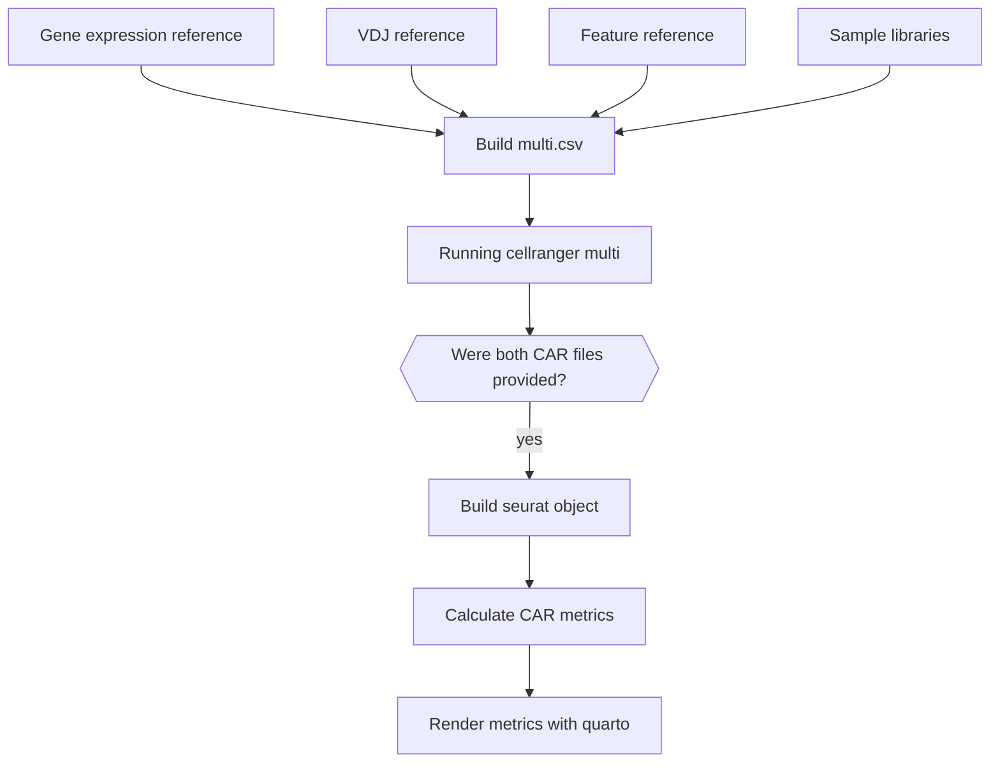

# Secondary Analysis
The `RUN_SECONDARY_ANALYSIS` workflow, defined in `workflows/secondary_analysis.nf`, handles all processes that generate outputs for further analysis. This includes running `cellranger multi`, merging processed samples into a single Seurat object, and generating CAR-specific metrics to render using Quarto.

## Process Overview

1. **Creating the Multi Config File (`BUILD_MULTI_CSV`)**  
   Generates the `multi.csv` file required to run `cellranger multi`.

2. **Running Cell Ranger Multi (`CELLRANGER_MULTI`)**  
   Executes `cellranger multi` to process the sequencing data.

3. **Merging Samples into a Seurat Object (`SEURAT_OBJECT`)**  
   Once all samples have been processed, they are merged into a single Seurat object.

4. **Calculating CAR-Specific Metrics (`CAR_METRICS`)**  
   Computes CAR-specific metrics based on the `sample_alignments.bam` file produced by `CELLRANGER_MULTI`.

5. **Visualizing Metrics with Quarto (`QUARTO`)**  
   Uses Quarto to render and visualize the metrics generated in the `CAR_METRICS` step.

This workflow ensures that raw sequencing data is processed, analyzed, and visualized efficiently.

## Simplified diagram

