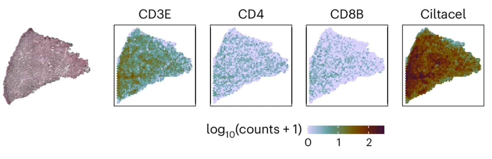

---
hide:
  - navigation
  - toc
---

# Technologies for adoptive immunotherapies

## Multi-omics single-cell sequencing

Multi-omics single-cell sequencing from 10x Genomics integrates multiple layers of biological data—such as transcriptomics (RNA), immune repertoire profiling, and surface protein expression—at the resolution of individual cells. In adoptive immunotherapies like CAR T cell therapy, this technology enables researchers to simultaneously analyze how these diverse modalities interact, providing a comprehensive view of CAR T cell biology, immune repertoire diversity, and the tumor microenvironment.

<figure class="left-size">
  
</figure>

  - **[5’ and 3’ single-cell RNA sequencing](https://www.10xgenomics.com/solutions/single-cell/)**: These methods capture either the 5’ or 3’ ends of mRNA transcripts, revealing gene expression profiles with high resolution. In CAR T cell therapy, this can uncover activation states, cytokine production, and tumor-antigen responses, as well as heterogeneity within cell populations.

  - **[Immune profiling](https://www.10xgenomics.com/solutions/immunology/)**: 10x Genomics' Single-Cell Immune Profiling platform enables simultaneous analysis of gene expression and **T-cell receptor (TCR) or B-cell receptor (BCR) sequences**, providing insights into immune cell clonality, diversity, and receptor specificity. This allows precise tracking of CAR T cells, mapping out clonal dynamics, exhaustion states, and functional markers critical for therapeutic success. 
  In addition, the platform supports **surface protein expression** profiling via feature barcoding. These surface markers complement transcriptomic data by providing information on post-transcriptional regulation, activation states, and cell–cell interaction potential—enabling more accurate and functionally relevant cell-type classification in complex immune environments.

## Spatial sequencing

<figure class="left-size">
  
  <figcaption>Image from <a href="https://www.prnewswire.com/news-releases/10x-genomics-commercially-launches-visium-hd-spatial-gene-expression-assay-302099533.html">10xGenomics</a></figcaption>
</figure>

[Spatial sequencing](https://www.10xgenomics.com/solutions/spatial-gene-expression) technologies, such as **[Visium](https://www.10xgenomics.com/products/spatial-gene-expression)** and **[Visium HD](https://www.10xgenomics.com/products/spatial-gene-expression-hd)** by 10x Genomics, map gene expression profiles to their specific locations within tissue samples. By preserving spatial context, these technologies provide critical insights into how immune cells interact with tumor cells, offering a more comprehensive understanding of therapy efficacy. This information can help refine CAR T cell therapies by identifying factors that influence their success or resistance within the tumor microenvironment. 

## Custom Probes for CAR detection

<figure class="left-size">
  
  <figcaption>Image from <a href="https://www.nature.com/articles/s41591-025-03499-9#Fig2">Fig 2J at Braun et.al</a></figcaption>
</figure>

We have developed custom probes for robust detection of Carvykti in Visium (HD) spatial transcriptomics. The probe design was based on the specifications of the technical note “[CG000621](https://www.10xgenomics.com/support/spatial-gene-expression/documentation/doc/technical-note-designing-custom-probes-for-visium-spatial-gene-expression-cg000621)” from 10x Genomics. The positioning of the probes within the chimeric CAR construct was chosen to span the boundaries of the cloned domains, resulting in unique sequences that were inserted into the Visium Probe Set v1 for data analysis.

**For more information please contact:** Blumert, Conny <conny.blumert@izi.fraunhofer.de>
