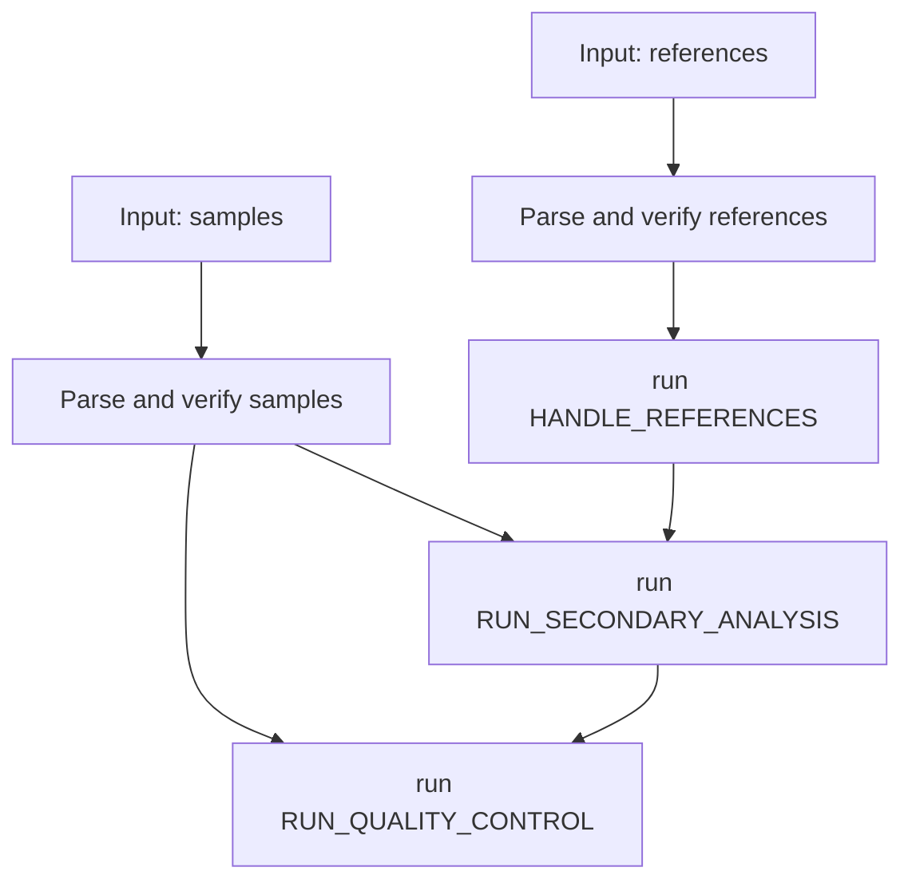

# The `main.nf` script
The `main.nf` script is responsible for handling user input —parsing and verifying sample data and references— before then assembling the different subworkflows.

## Parsing Sample Data
The first step is converting the `params.samples` map, which contains sample data, into a more structured format. This is done using a custom `Sample` class that takes care of most of the validation and processing in its constructor, ensuring paths and values are correct.

Each `Sample` object closely resembles the original map but comes with additional functionality. Additionally, a `Library` class is used to capture sample libraries separately, parsing and validating their data as well.

## Handling References
A similar approach is used for reference management. The `ReferenceManager` class takes in the `params` attribute and instantiates an object that validates and processes all reference-related parameters.

## Why Use Objects?
Rather than simply validating the input parameters, we cast them into objects. While this results in more code, it significantly improves data organization and overall code quality, making it easier to manage and extend in the long run.

## Executing the Workflow Pipeline
Once verification is complete, the `HANDLE_REFERENCES` subworkflow is triggered to generate a gene expression reference if needed. Next, the `RUN_SECONDARY_ANALYSIS` workflow runs, using the validated references and samples as input. Finally, the `RUN_QUALITY_CONTROL` subworkflow is executed to consolidate the results.

## Simplified diagram

