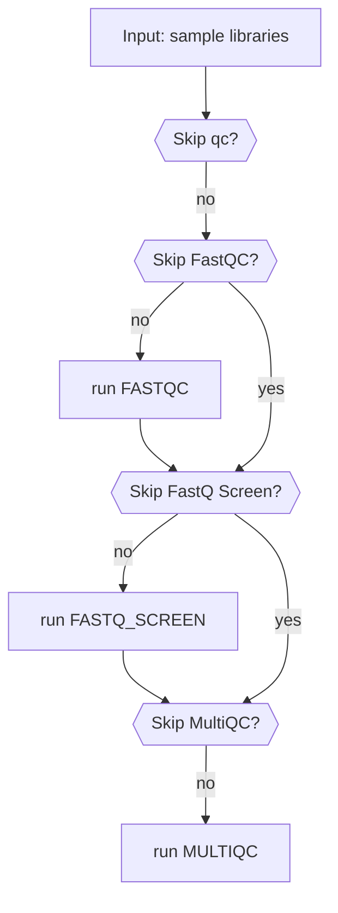

# Quality Control Workflow
The `RUN_QUALITY_CONTROL` workflow is responsible for performing quality control (QC) checks on sequencing data. It includes three main processes: `FASTQC` for quality assessment, `FASTQ_SCREEN` for contamination screening, and `MULTIQC` for aggregating QC reports. These steps can be selectively skipped based on user-defined parameters.

## Process Overview

1. **Quality Assessment with FastQC (`FASTQC`)**
    - Runs `FastQC` on input FASTQ files to generate per-sample quality reports.
    - Uses sample metadata to correctly resolve file paths.
    - Saves the output in a `{sample_name}/fastqc` directory.

2. **Contamination Screening with FastQ Screen (`FASTQ_SCREEN`)**
    - Runs `FastQ Screen` to check for contamination by mapping reads against multiple reference genomes.
    - Filters out non-relevant FASTQ files based on sample metadata.
    - Generates results in `{sample_name}/fastqs`.

3. **Aggregating Reports with MultiQC (`MULTIQC`)**
    - Collects outputs from `FASTQC`, `FASTQ_SCREEN`, and `CellRanger Multi` runs.
    - Uses a provided configuration file to customize the final QC report.
    - Outputs a consolidated report in the `multiqc` directory.

## Workflow Execution

- The workflow takes in sample names, FASTQ metadata, file paths, and configuration files.
- If QC is enabled (`skip_qc = false`), it runs the necessary processes based on the selected options (`skip_fastqc`, `skip_fastq_screen`, `skip_multiqc`).
- The final QC reports are emitted as outputs, allowing further analysis.

This structured approach ensures that sequencing data is properly assessed for quality and contamination before downstream analysis.

